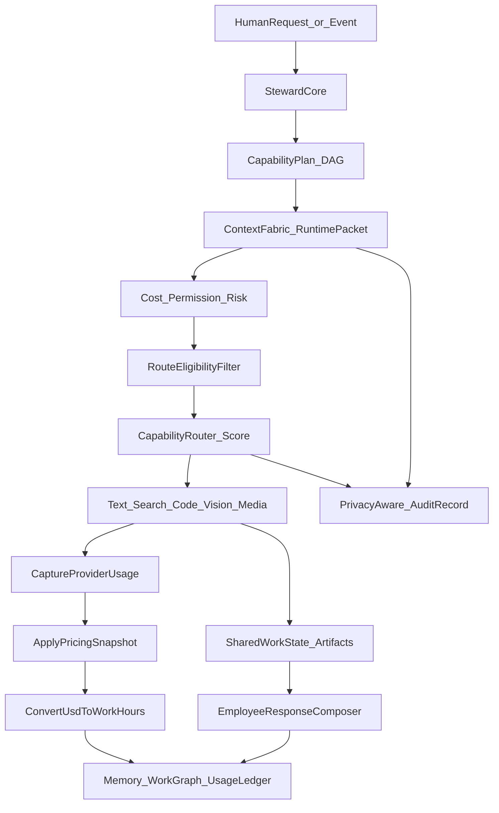

# AdeHQ Brain — V1 Engineering Plan

> Living doc. Supersedes [intelligence-v2-plan.md](intelligence-v2-plan.md) for routing/metering/costing concerns.
> Status: **V1 landed (PR-1…PR-10). Catalog PR-11 landed. PR-12 Auto UX + hot-path intensity wiring landed.**  
> Next: PR-13 Step-3.5 promote only after agreement harness proves parity → PR-14 search → vision/media.  
> Last grounded against the codebase 2026-07-16.

## Product lock

**Users hire the employee. AdeHQ assembles the right brain for every piece of work.**

- Employee identity stays stable (name, role, tone, permissions, memory).
- **Capability** = kind of work; **Intensity** = budget/depth; **Route** = provider/model implementation. Never conflate them.
- Users see Work Hours and outcomes — never model SKUs (admins/diagnostics only).
- Metering is mandatory, accurate, and background — every provider call that spends money records real usage units and USD before converting to WH.
- Canonical conversion (non-negotiable): `1 AI Work Hour = $0.01 USD`; `workHours = actualCostUsd / 0.01`.
- Every actual charge is reproducible from an immutable **pricing snapshot**.



---

## Part 1 — Current-state audit (read this before writing code)

Brain V1 is **not** greenfield. A commercial ledger, per-million rate resolution, a capability router, and pricing sync already exist. Most of V1 is *correcting and unifying* these, not building new systems. Every claim below is verified against source.

### 1.1 What already exists and is kept

| Concern | Where | Verdict |
|---|---|---|
| Commercial ledger table | `supabase/migrations/20260706210000_commercial_usage_ledger.sql` → `ai_cost_ledger_entries` (tokens, search, browser units, `work_hour_usd_rate`, `work_hours_charged`, `cost_source`, `billable_to_workspace`, `platform_overhead`) | **Keep; extend** (snapshot id, media units, versions, idempotency key) |
| Single ledger write path | [`record-cost-event.ts`](../../src/lib/billing/costing/record-cost-event.ts) `recordCostEvent()` — computes WH, rolls into weekly period | **Keep** — `recordBrainUsage()` wraps this, does not replace it |
| Per-million token math | [`token-rates.ts`](../../src/lib/billing/costing/token-rates.ts) `estimateTokenCostUsd()` — cached-subset semantics already correct | **Keep** — becomes the one cost formula, fed by snapshots |
| Cost precedence | [`calculate-model-cost.ts`](../../src/lib/billing/costing/calculate-model-cost.ts): provider actual → tokens×rates → queue-time estimate | **Keep precedence; fix labeling** (see 1.2-B) |
| WH conversion | [`work-hours.ts`](../../src/lib/billing/costing/work-hours.ts): `workHoursFromCost` (4dp round), `displayWorkHours` (floor 2dp) | **Keep**; pin `$0.01` (locked D1) |
| Capability router | [`capability-router.ts`](../../src/lib/ai/runtime/capability-router.ts): pinned policy + route-optimizer (off/shadow/on) | **Keep as scoring core**; wrap with eligibility filter. NOTE: the `routeCapability` doc comment "planning only… not wired to callers" is **stale** — it is wired via `src/lib/ai/runtime/index.ts`, `runtime-log.ts`, and the browser-research orchestrator |
| Pricing sync | `src/lib/ai/runtime/pricing/` (manual overrides, Vercel + SiliconFlow sync, SKU parser) and DB table `ai_model_price_snapshots` (migration `20260706120000_model_marketplace_v201.sql`) | **Keep** — PricingSnapshot builds on this, not beside it (see Part 4) |
| Flag pattern | [`flags.ts`](../../src/lib/ai/runtime/flags.ts): env + `getCachedPlatformFlag` (DB-backed) | **Reuse** for `ADEHQ_BRAIN_V1` |
| Weekly WH enforcement | `checkWorkspaceAiCapacity` + `applyCostToPeriod` in `src/lib/billing/usage/periods` | **Keep**; CostPolicy layers on top |
| Runtime packet precursor | [`intelligence-context.ts`](../../src/lib/ai/intelligence/intelligence-context.ts) `IntelligenceContext` with per-layer `steps[]` | **Keep**; adapt into `CognitivePacketRuntime` |

### 1.2 Known defects to fix (these are the real "undercounting bugs")

Each one gets fixed in PR-2 with a regression test named for it.

- **A. Multi-step charge drop (silent undercount).** `ai_cost_ledger_entries` has a unique index on `(work_unit_id, source_type)` and `recordCostEvent` swallows `23505` duplicates (returns `null`). A run that makes **two LLM calls under one work unit** ledgers only the first — the second charge is silently dropped. Brain runs are multi-step by design, so this becomes systematic. Fix: add an explicit `idempotency_key` column (`{workUnitId}:{stepId}:{attempt}`), unique on that; keep the old index only for legacy writers until they migrate.
- **B. `costSource` stomp + redundant recompute.** [`cost-guard.ts:305–311`](../../src/lib/ai/cost-guard.ts): after `calculateModelCost()` returns, the result is unconditionally overwritten by a second `estimateCost()` call and `costSource` is forced to `"estimated"` whenever tokens exist — so provider-reported actuals are discarded and every row looks estimated. Fix: `calculateModelCost` is the single decision; delete the recompute block. Also introduce `costSource: "token_rates"` (distinct from `provider_usage` and `estimated`) so "computed from real token counts × snapshot rates" is not labeled as a guess.
- **C. Floor inflates small replies (overcharge, ~5×).** [`cost-guard.ts:314–325`](../../src/lib/ai/cost-guard.ts) applies a `$0.0001` floor **and** a 0.01-WH visible minimum even when real tokens were reported. A 100-in/20-out Flash reply costs ~$0.0000186 (0.0019 WH) but is charged 0.01 WH. Fix: floors apply **only when `inputTokens + outputTokens + cachedInputTokens == 0` and no media units** (empty telemetry); when any unit exists, charge the computed value exactly. (Whether a *display* minimum stays is Open decision D2 — but the ledger must store the true value regardless.)
- **D. Cancel path ledgers nothing.** `cancelAiWorkUnit` ([`ai-work-units.ts:362–373`](../../src/lib/supabase/ai-work-units.ts)) patches status only. Plan requires: user cancellation → partial WH for tokens already spent. Fix: accept the same `result` shape as fail, call the usage recorder.
- **E. Double-charge exposure between mirror and work-unit paths.** `finalizeAiRun`'s ledger mirror (`recordCommercialUsageFromFinalizedRun`) writes with **no `work_unit_id`**, so dedupe key (A) cannot protect against `completeAiWorkUnit` also charging the same underlying model call. PR-2 must map, per execution path (direct / queued / autonomous), which single hook is canonical, and pass the idempotency key through both so the DB enforces it.
- **F. Adapters compute cost themselves.** `usageFromTokens()` inside both [`siliconflow.ts`](../../src/lib/ai/runtime/adapters/siliconflow.ts) and [`vercel-gateway.ts`](../../src/lib/ai/runtime/adapters/vercel-gateway.ts) calls `estimateCost` and attaches `modelCostUsd` to usage. Cost is then computed *again* at ledger time — two places to drift. Fix: adapters return **raw usage only** (tokens, latency, credential); USD is computed exactly once, in the metering spine, from the snapshot.
- **G. Platform-overhead classification by string matching.** [`record-work-unit-cost.ts:15–18`](../../src/lib/billing/costing/record-work-unit-cost.ts): `workType.includes("classify") || workType.includes("steward")`. A work type like `email_classifier_review` silently becomes unbilled. Fix: explicit `billableToWorkspace` set at work-unit creation; string heuristic kept only as a logged fallback for legacy rows.
- **H. Legacy "work minutes" still live in the router.** [`capability-router.ts:34–43`](../../src/lib/ai/runtime/capability-router.ts) estimates in work minutes via `getWorkMinuteUsdRate()`. Route decisions must carry `estimatedMinCostUsd / LikelyCostUsd / MaxCostUsd` (and derived WH), not minutes.
- **I. Zero-cost skip hides mock/dev telemetry.** `recordCostFromWorkUnit` returns early when `costUsd <= 0`. Fine for billing, but Brain diagnostics want the row with `billableToWorkspace: false`. Fix in spine: always record when a provider was actually called; skip only pure mock.

### 1.3 Billable call-site inventory (the spine must cover all of these)

Verified writers/creators today:

| Path | File | Today | Target |
|---|---|---|---|
| Direct employee reply finalize | `src/lib/server/process-employee-response.ts` → `finalizeAiRun` | mirror w/ bugs B, C, E | `recordBrainUsage` |
| Queued orchestration runs | `src/lib/server/process-queued-run.ts` | mixed finalize + work-unit | `recordBrainUsage` per step |
| Work-unit complete/fail | `src/lib/supabase/ai-work-units.ts` → `recordCostFromWorkUnit` | tokens via metadata; cancel unmetered (D) | `recordBrainUsage`; cancel included |
| Integration jobs | `src/lib/integrations/jobs/worker.ts` → `record-integration-job-cost.ts` | separate recorder | wraps `recordBrainUsage` |
| Search answers | `src/lib/ai/search/search-answer.ts` (work units) + `calculate-search-cost.ts` | per-request pricing via env consts | snapshot-priced |
| Browser research | `src/lib/ai/browser-research/orchestrator.ts` | env-const session pricing | snapshot-priced |
| Embeddings | `src/lib/server/file-embeddings.ts`, `src/lib/orchestration/employee-role-embeddings.ts` | work units | spine |
| Steward / classifier | `src/lib/orchestration/llm-classifier.ts` (creates work units) | overhead by string match (G) | explicit `billableToWorkspace:false`, still recorded |
| Topic summaries, hiring LLMs, hot-path shadow | `src/lib/topic-summary/generate.ts`, `src/lib/hiring/*-llm.ts`, `src/lib/ai/runtime/hot-path-shadow.ts` | work units | spine |

Acceptance for PR-2 includes a checked-off row for every line of this table.

---

## Part 2 — Core invariants and glossary

| Concept | Meaning | Must not become |
|---|---|---|
| Capability | Kind of work (`reasoning`, `image_generation`, …) | A model ID |
| Intensity | Budget/depth (`fast` / `standard` / `deep` / `research`) | A disguised model pick |
| Route | `CapabilityRoute` implementing a capability | A price |
| Pricing snapshot | Immutable rates for a route at a time | Embedded forever in a route ID |
| Work Hour | `$0.01` of actual billable USD | A per-model markup knob |

Naming note: the existing `WorkMode` union is `fast | balanced | deep | research | collaboration` (`intelligence-context.ts`, used by `ChatComposer.tsx`). Brain vocabulary is `fast | standard | deep | research`. PR-5 renames `balanced → standard` behind a mapping (accept both on input, emit `standard`) and folds `collaboration` into the steward decision, not the intensity axis.

---

## Part 3 — Data model (migrations, exact shapes)

One migration per PR that needs it; all tables RLS'd to workspace membership like `ai_cost_ledger_entries`.

### 3.1 `brain_pricing_snapshots` (PR-1)

Immutable rows. The existing `ai_model_price_snapshots` table is a *sync cache* of provider price feeds — it stays as the **source** that proposes new snapshots; `brain_pricing_snapshots` is the **billing authority** referenced by charges.

```sql
create table public.brain_pricing_snapshots (
  id text primary key,                    -- e.g. 'ps_v4flash_sf_2026-07-16'
  route_id text not null,
  currency text not null default 'USD',
  effective_from timestamptz not null,
  effective_to timestamptz null,          -- set when superseded; rows never mutate otherwise
  input_per_million numeric(14,8) null,
  output_per_million numeric(14,8) null,
  cached_input_per_million numeric(14,8) null,
  per_image numeric(14,8) null,
  per_video numeric(14,8) null,
  per_thousand_utf8_bytes numeric(14,8) null,
  per_search_request numeric(14,8) null,
  per_browser_second numeric(14,8) null,
  source text not null,                   -- 'manual' | 'vercel_sync' | 'siliconflow_sync'
  created_at timestamptz not null default now()
);
create unique index on public.brain_pricing_snapshots (route_id) where effective_to is null; -- one live snapshot per route
```

Rules:
- Rate change ⇒ close the old row (`effective_to = now()`) and insert a new one. **Never** UPDATE rates.
- Sync jobs may *propose*; a snapshot only goes live via an explicit promote step (Control UI or script) so a bad feed can't silently reprice production.
- Charges always reference the snapshot that was live at charge time; historical usage is never rewritten.

### 3.2 Ledger extension (PR-2)

```sql
alter table public.ai_cost_ledger_entries
  add column pricing_snapshot_id text null,
  add column idempotency_key text null,
  add column image_count integer not null default 0,
  add column video_count integer not null default 0,
  add column tts_utf8_bytes integer not null default 0,
  add column brain_run_id text null,
  add column decision_attempt_id text null,
  add column packet_version text null,
  add column decision_version text null,
  add column router_version text null,
  add column catalog_version text null;
create unique index uq_ledger_idempotency on public.ai_cost_ledger_entries (idempotency_key)
  where idempotency_key is not null;
```

`cost_source` gains the value `'token_rates'` (check constraint update). Legacy rows keep NULL snapshot/versions; a one-off backfill tags them `pricing_snapshot_id = 'ps_legacy_unknown'` so queries never special-case NULL.

### 3.3 `brain_runs`, `brain_decision_attempts`, `brain_capability_steps` (PR-3)

```sql
create table public.brain_runs (
  id text primary key,
  workspace_id uuid not null references public.workspaces(id) on delete cascade,
  employee_id text null,
  room_id text null, topic_id text null, trigger_message_id text null,
  intensity text not null,                -- fast|standard|deep|research
  packet_version text not null, decision_version text not null,
  router_version text not null, catalog_version text not null,
  status text not null default 'running', -- running|completed|failed|cancelled|blocked
  final_accepted_decision_id text null,
  created_at timestamptz not null default now(),
  completed_at timestamptz null
);

create table public.brain_decision_attempts (
  id text primary key,
  brain_run_id text not null references public.brain_runs(id) on delete cascade,
  attempt_number integer not null,
  reason text not null,          -- 'initial' | failure-taxonomy value that triggered this attempt
  capability text not null,
  intensity text not null,
  route_id text not null,
  eligibility_rejections jsonb not null default '[]', -- [{routeId, reason}] routes filtered before scoring
  score_factors jsonb null,
  status text not null default 'running', -- running|accepted|failed|superseded
  created_at timestamptz not null default now(),
  unique (brain_run_id, attempt_number)
);
-- Immutability: no UPDATE beyond status transitions running→{accepted,failed,superseded}; enforce in code review + a trigger that rejects changes to route_id/capability/intensity.

create table public.brain_capability_steps (
  id text primary key,
  brain_run_id text not null references public.brain_runs(id) on delete cascade,
  decision_attempt_id text not null references public.brain_decision_attempts(id),
  capability text not null,
  route_id text not null,
  dependencies text[] not null default '{}',
  input_artifact_ids text[] not null default '{}',
  output_contract jsonb not null,          -- {type, schemaId?, artifactType?}
  estimated_min_cost_usd numeric(14,8) not null default 0,
  estimated_likely_cost_usd numeric(14,8) not null default 0,
  estimated_max_cost_usd numeric(14,8) not null default 0,
  max_cost_usd numeric(14,8) not null,     -- hard ceiling, server-enforced
  approval_required boolean not null default false,
  route_affinity_key text null,
  route_stickiness text not null default 'task',  -- none|task|artifact|conversation
  status text not null default 'pending',
  created_at timestamptz not null default now()
);
```

`work_unit_id` remains the join to the existing execution machinery; Brain tables reference runs/steps, the ledger references both.

### 3.4 `CognitivePacketAuditRecord` (PR-3)

Stored in a `brain_packet_audits` table: snapshot id, source ids, **content hashes**, selected excerpt refs, decision metadata. Full compiled context (emails, files, room text) is **never** durably stored by default — the runtime packet dies with the request. Audit rows are what "why did it do that" debugging reads.

---

## Part 4 — Metering spine: `recordBrainUsage()` (PR-2, the load-bearing PR)

One helper, `src/lib/brain/metering/record-brain-usage.ts`, that every billable path calls. It wraps `recordCostEvent` — it does not fork the ledger.

```ts
type BrainUsageInput = {
  client: SupabaseClient;
  workspaceId: string;
  idempotencyKey: string;              // `${workUnitId ?? brainRunId}:${stepId}:${attempt}` — REQUIRED
  // identity/context (all optional nulls as today)
  employeeId?: string; workUnitId?: string; brainRunId?: string; decisionAttemptId?: string;
  roomId?: string; topicId?: string; messageId?: string;
  sourceType: CostSourceType;          // llm|embedding|search|browser|image|video|tts|...
  routeId: string;                     // Brain route; resolves provider/model/snapshot
  // usage — RAW units from the provider, never pre-priced
  usage: {
    inputTokens?: number; cachedInputTokens?: number; outputTokens?: number;
    imageCount?: number; videoCount?: number; ttsUtf8Bytes?: number;
    searchRequests?: number; browserSessionSeconds?: number;
    providerReportedCostUsd?: number;  // when the provider bills a total directly
  };
  status: "succeeded" | "failed" | "cancelled";
  billableToWorkspace: boolean;        // explicit — no string heuristics
  metadata?: Record<string, unknown>;
};
```

Resolution algorithm (deterministic, unit-tested):

1. Resolve route → provider/model + **live pricing snapshot** (`effective_to is null`). If no snapshot exists: charge via `resolveTokenRates` fallback, set `pricing_snapshot_id = 'ps_missing'`, `costSource: 'estimated'`, and emit a warn-level diagnostic — never throw away the charge, never block the reply.
2. Compute USD, strict precedence:
   - `providerReportedCostUsd` present ⇒ use it, `costSource: 'provider_usage'`.
   - any token/media unit > 0 ⇒ snapshot formula, `costSource: 'token_rates'`:
     - tokens: `uncached×in + cached×cachedIn + output×out` per-million (reasoning tokens count as output when the provider bills them that way — adapter maps them into `outputTokens`).
     - media: `perImage×imageCount + perVideo×videoCount + (ttsUtf8Bytes/1000)×perThousandUtf8Bytes + perSearchRequest×searchRequests + perBrowserSecond×browserSessionSeconds`.
   - all units zero AND a real provider was called ⇒ last-resort floor `$0.0001`, `costSource: 'estimated'` (the ONLY place a floor exists).
3. `workHours = costUsd / 0.01` (via `workHoursFromCost`).
4. Write through `recordCostEvent` with snapshot id, versions, idempotency key. `23505` on `idempotency_key` ⇒ genuinely already recorded ⇒ safe no-op (this is now correct, unlike defect A).
5. `status: failed/cancelled` rows still charge the units that were consumed.

Adapter contract change (defect F): `usageFromTokens` stops computing `modelCostUsd`; `RuntimeResult.usage` is raw counts + latency + credential only.

**Migration of existing writers** — in the same PR, mechanical:
- `recordCommercialUsageFromFinalizedRun` (cost-guard) → delete floor/stomp logic, call spine.
- `recordCostFromWorkUnit` → thin wrapper over spine (keeps metadata extraction), `billableToWorkspace` from the work unit column, not string matching.
- `cancelAiWorkUnit` gains a `result` param and calls the spine with `status: 'cancelled'`.
- `record-integration-job-cost`, search, browser recorders → spine with their unit types.

---

## Part 5 — Four-layer catalog (PR-1 + PR-11 alignment)

```text
src/lib/brain/catalog/
  capabilities.ts       # BrainCapability (AiCapability + vision/media/search_* )
  routes.ts             # CapabilityRoute — NO prices; lifecycle states
  pricing-snapshots.ts  # immutable seed + accessors
  routing-policy.ts     # production scoring only (shadow/eval excluded)
  version.ts            # CATALOG_VERSION = "2"
```

```ts
environment: "production" | "fallback" | "shadow" | "evaluation" | "disabled"
```

**Production (live scoring):** V4 Flash, V4 Pro (+ SF failover), MiniMax M2.5 (+ native Gateway + SF fallbacks), Qwen3 Coder, Qwen3-8B classifier, Qwen3 Embedding, Tavily, Browserbase.

**Shadow (catalogued, not live):** Step-3.5-Flash, Perplexity, Exa, Qwen3-VL-8B/32B, Z-Image-Turbo, Qwen-Image, Qwen-Image-Edit, FLUX.2-flex, Wan T2V/I2V, CosyVoice2, IndexTTS-2, Fish Speech.

**Evaluation:** Kimi-K2.7-Code, Qwen3.6-35B/27B, GLM-5.2, MiniMax M3.

**Disabled (reserved):** `route_stt_fast` / `accurate` / `diarized` — model TBD.

Control UI: `/admin/brain-catalog`. Invariant tests: `npm run test:brain`.

---

## Part 6 — Packets, decisions, versions (PR-3)

- `CognitivePacketRuntime` = today's `IntelligenceContext` + `packetVersion`, `intensity`, `capabilityPlan`, artifact refs. Provide `fromIntelligenceContext()` adapter so nothing rewrites the existing pipeline in one go.
- Every run stamps `packetVersion: "1"`, `decisionVersion: "1"`, `routerVersion` (export from router module), `catalogVersion`, and each charge carries `pricingSnapshotId` (Part 3.2 columns).
- Escalation or added capability ⇒ **new** `brain_decision_attempts` row with `reason` from the failure taxonomy; prior attempts get `status: 'superseded'`, nothing else about them changes.
- `CapabilityStep.outputContract` is required. Text steps: `{type:"text"}`. JSON/tool steps: `{type:"json", schemaId}` — the schema registry starts as a plain map in `src/lib/brain/contracts.ts`. Chained media (Phase 4) consumes contracted artifacts, never free-form prose.

---

## Part 7 — Router: eligibility → score → stickiness (PR-4)

Wrap, don't rewrite: `routeCapabilityV2(input)` runs the eligibility filter over catalog routes, then delegates scoring to the existing `buildPinnedBaseDecision` + `applyRouteOptimizer`, constrained to survivors.

```ts
type EligibilityRejection = { routeId: string; reason:
  "capability_unsupported" | "provider_unhealthy" | "workspace_provider_blocked" |
  "employee_permission" | "context_window" | "modality_unsupported" |
  "tools_unsupported" | "cost_ceiling" | "data_policy" | "environment_not_production" };
```

- Rejections are recorded on the decision attempt (`eligibility_rejections`) — this is the debuggability payoff.
- Provider health comes from existing `route-health.ts`.
- **Stickiness:** `routeAffinityKey` (e.g. topic id or artifact id) → prefer the last accepted route for that key unless the new attempt's `reason` is an escalation. Store affinity in `brain_runs` metadata; no new table.
- **Failure taxonomy** (enum shared by attempts + fallback logic):

| Failure | Fallback |
|---|---|
| `provider_unavailable` | backup route, new attempt |
| `timeout` | retry once, then backup route |
| `invalid_schema` | one repair-prompt retry, same route |
| `tool_failure` | retry or degrade with explanation |
| `policy_rejection` | stop; surface approval needed |
| `cost_ceiling` | stop; ask user — **no silent continue** |
| `low_confidence` | escalate route if budget permits, new attempt |
| `user_cancelled` | abort; partial WH already ledgered (Part 4 step 5) |

Also in PR-4: replace router work-minute estimates (defect H) with `estimatedMin/Likely/MaxCostUsd` on the decision, derived from token estimates × the route's snapshot.

---

## Part 8 — Auto intelligence UX + migration (PR-5)

- `EmployeeIntelligencePanel.tsx`: hide Efficient/Balanced/Strong; single "Auto" state with copy explaining AdeHQ picks the brain per task. Admin diagnostics view keeps route/snapshot detail.
- DB: `employees.intelligence_mode` gains `'auto'`; migration maps existing values to `auto` **while preserving effective behavior** — legacy explicit tiers translate to a per-employee routing bias (`preferredIntensityFloor`) so a "Strong" employee doesn't suddenly answer with Flash. Bias is dropped the first time an admin edits the employee's policy (that edit is the consent moment).
- Composer chips: `fast | standard | deep | research` (rename per Part 2); chips set **intensity only**. Assert in code: no path maps a chip directly to a model id (`intensity ≠ model` invariant test greps the route resolution call graph).
- Kill switch `ADEHQ_BRAIN_V1` (platform flag + env, same pattern as `AI_RUNTIME_V2_MODE`): `0` restores the prior selection path. **Scope carefully:** the flag gates *routing/UX/decision persistence*. It does NOT gate the PR-2 metering fixes — those are bug fixes to billing and stay on unconditionally.

---

## Part 9 — CostPolicy, WH ranges, receipts (PR-6, PR-7)

```ts
type CostPolicy = {
  showEstimateAboveWh: number;           // default 2  — informational banner
  requireUserConfirmAboveWh: number;     // default 10 — blocking confirm
  requireManagerApprovalAboveWh: number; // default 25 — routed to approver
  hardBlockAboveWh: number;              // default 100 — refuse, explain
};
```

- Stored in workspace AI settings (extend `loadWorkspaceAiSettings`); the four states are distinct UI paths, not one modal with different copy.
- Enforcement points: (a) plan time — `beginAiRun` already checks weekly capacity + daily limits; add CostPolicy thresholds against `estimatedLikelyWh`; (b) **mid-run, server-side** — the step runner accumulates actual USD and aborts the step loop when the run's `maxCostUsd` (sum of step ceilings) would be exceeded, surfacing `cost_ceiling` per the taxonomy. Client-side numbers are advisory only.
- Variable work shows a range: `Estimated use: 2–5 WH · Maximum allowed: 8 WH` from `estimatedMin/Likely/Max`. Flat media shows exact WH.
- **Receipt (PR-7):** expandable element under the assistant message: total WH + per-capability breakdown, sourced from ledger rows joined on `brain_run_id`. Members never see model ids; the admin view adds route + snapshot ids. Use `displayWorkHours` (floor 2dp) for all member-facing numbers.

---

## Part 10 — Media V1 scope + Steward facade (PR-8, PR-9)

- **Media:** catalog + snapshots exist (`environment: "evaluation"`); AdeHQ Control gets a read-only catalog browser with estimate math. **No customer-facing Create image/video buttons** — not even disabled ones with "Coming soon" tooltips. Feature-flagged test workspaces may see real controls only when execution works end-to-end. Live generation is Phase 4.
- **Steward Core facade (PR-9):** `src/lib/brain/steward-core.ts` exposes `decide(input): StewardDecision` and internally dispatches to `room-steward.ts` / `dm-steward.ts` / `topic-steward.ts` unchanged. Zero behavior change — the facade exists so Phase 3 (leases, blackboard) has one seam. Snapshot tests assert identical decisions before/after.

---

## Part 11 — Test matrix (PR-2 blocks merge without these)

Exact vectors, using seeded snapshot rates. All assertions on unrounded USD, then `workHoursFromCost` (4dp), then `displayWorkHours` (2dp floor).

| Case | Route/rates | Units | USD | WH (ledger) | WH (display) |
|---|---|---|---|---|---|
| Cached-subset math | V4 Flash SF 0.13/0.28/0.028 | in 1,000,000 (cached 200,000), out 50,000 | 0.104 + 0.0056 + 0.014 = **0.1236** | 12.36 | 12.36 |
| Deep reasoning | V4 Pro Gateway 0.43/0.87 | in 120,000, out 8,000 | **0.05856** | 5.856 | 5.85 |
| Small real reply — no floor | V4 Flash SF | in 900, out 250 | **0.000187** | 0.0187 | 0.01 |
| Tiny reply — floor must NOT fire (regression for defect C) | V4 Flash SF | in 100, out 20 | **0.0000186** | 0.0019 | 0.00 |
| Empty telemetry — floor fires | any | all zero, provider called | 0.0001 | 0.01 | 0.01 |
| Flat image | Qwen-Image $0.02 | imageCount 3 | 0.06 | 6 | 6.00 |
| TTS | CosyVoice $0.00715/1K | 2,750 bytes | 0.0196625 | 1.9663 | 1.96 |
| Idempotency (defect A) | — | same key twice | one row | — | — |
| Two steps, one work unit (defect A) | — | distinct step ids | **two rows** | — | — |
| Cancelled run (defect D) | — | partial tokens | charged | — | — |
| costSource labeling (defect B) | — | provider counts | `token_rates`, never `estimated` | — | — |
| Snapshot immutability | — | rate change | new snapshot id; old rows reproduce old USD | — | — |

Plus property test: for any units and snapshot, `ledger.work_hours_charged == round4(actual_cost_usd / work_hour_usd_rate)`.

---

## Part 12 — PR sequence (each independently shippable, each with its own flaggable risk)

| # | PR | Scope | Key files | Exit criteria |
|---|----|-------|-----------|---------------|
| 1 | Catalog + snapshots | Part 3.1, Part 5; seed routes/snapshots; `CATALOG_VERSION` | `src/lib/brain/catalog/*`, migration | invariant tests green; no runtime behavior change |
| 2 | **Metering spine** | Part 4 + all defects A–I + ledger migration 3.2 | `src/lib/brain/metering/*`, `cost-guard.ts`, `record-*.ts`, adapters, `ai-work-units.ts` | full Part 11 matrix; call-site inventory (1.3) fully migrated; Usage page totals unchanged for normal traffic ±rounding, small-reply overcharge gone |
| 3 | Packet/decision persistence | Part 3.3–3.4, Part 6 | `src/lib/brain/{packet,decisions}/*` | every Brain run persists versions + attempts; audit stores hashes not content |
| 4 | Eligibility router | Part 7 | `src/lib/brain/router/*` wrapping `capability-router.ts` | rejections recorded; shadow-mode parity report vs old router before flip |
| 5 | Auto UX + kill switch | Part 8 | `EmployeeIntelligencePanel.tsx`, `ChatComposer.tsx`, employee migration | legacy employees keep effective behavior; `ADEHQ_BRAIN_V1=0` restores old path with metering intact |
| 6 | CostPolicy + server max | Part 9 | settings, `beginAiRun`, step runner | 4 distinct threshold behaviors; mid-run abort test |
| 7 | WH receipt | Part 9 | message UI + ledger query | receipt totals equal ledger sums; no model ids for members |
| 8 | Control media catalog | Part 10 | Control UI | zero customer-facing media CTAs (assert via route audit) |
| 9 | Steward facade | Part 10 | `steward-core.ts` | decision snapshot tests identical |
| 10 | Cleanup | delete work-minute estimator, stale router comment, legacy dedupe index once writers migrated | — | grep-clean: no `work_minute`, no `estimateWorkMinutes` |

Ordering rationale: 1 and 2 have no UX surface and de-risk everything else; 2 fixes live billing bugs and should not wait for the router work. 3–4 are invisible persistence/routing; 5 is the first user-visible change and therefore carries the kill switch.

---

## Part 13 — Product decisions (locked for V1)

| ID | Decision | Locked answer |
|----|----------|---------------|
| **D1** | `AI_WORK_HOUR_USD` env override ([`work-hours.ts`](../../src/lib/billing/costing/work-hours.ts)) | **Pin `$0.01`**; delete env override. Per-row `work_hour_usd_rate` already records the rate used at charge time. |
| **D2** | Visible 0.01 WH minimum per reply | **No.** Ledger stores true WH; member UI uses `displayWorkHours` (floor 2dp). `$0.0001` / 0.01 WH floor only when telemetry is empty (defect C). |
| **D3** | Steward/classifier billing | **Keep unbilled** (`billableToWorkspace: false`) but **still record** tokens/USD for diagnostics (defects G/I). |
| **D4** | Who promotes pricing snapshots | **Control-only manual promote** in V1; sync jobs propose only. Automated promote-with-guardrails is Phase 6+. |

Cursor plan index: `.cursor/plans/adehq_brain_roadmap_7879533e.plan.md` (points here as authoritative eng plan).

---

## Phase 2+ (unchanged direction, out of V1 scope)

- **Phase 2:** intensity → enforced thinking/tool/search budgets; Step-3.5-Flash micro-routing shadow→prod; Flash→Pro and Coder→Kimi escalations as new attempts; search WH via snapshots (Perplexity/Exa/Tavily).
- **Phase 3:** multi-agent Steward — lead selection, work leases, shared findings blackboard, single final response; DM one voice; room mention-wins.
- **Phase 4:** vision + media live (VL-8B→VL-32B; image/video per catalog; Drive artifacts + approvals); customer verbs appear only when adapters + metering + confirm UX are green.
- **Phase 5:** TTS live; STT chosen + priced before any voice marketing.
- **Phase 6:** canary/shadow optimizer, quality scoring, provider health, enterprise route allowlists.

## Risk controls

- Kill switch gates routing/UX only; metering correctness is never behind a flag.
- No CoT transfer between models; no member-facing model names; no eval routes in production scoring.
- Historical usage never rewritten; new snapshots apply forward only.
- Audit store minimized by default (hashes + refs, not content).
